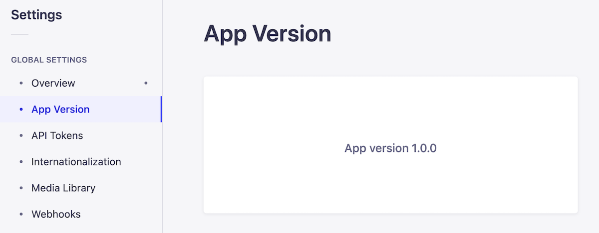

# Strapi plugin app-version

Simple plugin for Strapi 4 to show the app version from package.json in the Settings page.



## Installation

```sh
npm install @palmabit/strapi-app-version
```

or

```sh
yarn add @palmabit/strapi-app-version
```

## Author

[Palmabit.com](https://www.palmabit.com)
